# ORG ŞEMASI — ADOPS AI AGENCY (600 ajan)
> Üretim: 2026-07-17T11:10:38Z · Kaynak: data/org.json

```mermaid
flowchart TD
  OWNER[Metin Durak — Sahip] --> CEO[ceo-orchestrator]
  CEO --> coo_delivery[coo-delivery]
  CEO --> cso_strategy[cso-strategy]
  CEO --> cmo_brand[cmo-brand]
  CEO --> cto_platform[cto-platform]
  CEO --> cfo_finance[cfo-finance]
  CEO --> cdo_data[cdo-data]
  CEO --> cpo_product[cpo-product]
  CEO --> cro_revenue[cro-revenue]
  CEO --> cco_compliance[cco-compliance]
  coo_delivery --> prg[PRG: Programmatic Trading · 45]
  coo_delivery --> sea[SEA: Paid Search · 40]
  coo_delivery --> soc[SOC: Paid Social · 45]
  coo_delivery --> mob[MOB: Mobile UA & App Growth · 35]
  coo_delivery --> ret[RET: Retail & Commerce Media · 30]
  cmo_brand --> seo[SEO: SEO & Content Engine · 30]
  cpo_product --> cro[CRO: CRO & Experience · 25]
  cdo_data --> ana[ANA: Analytics & Measurement · 40]
  cdo_data --> dsc[DSC: Data Science & AI · 30]
  coo_delivery --> ops[OPS: Ad Ops & Trafficking · 35]
  cmo_brand --> cre[CRE: Creative Studio & DCO · 35]
  cso_strategy --> str[STR: Strategy & Comms Planning · 30]
  cro_revenue --> cls[CLS: Client Services · 30]
  cro_revenue --> nbd[NBD: New Business & Inbound Funnel · 25]
  cro_revenue --> prt[PRT: Partnerships & Sponsorships · 20]
  cpo_product --> prd[PRD: Product & Premium Pack · 20]
  cfo_finance --> fin[FIN: Finance & Billing · 15]
  cco_compliance --> leg[LEG: Legal & Compliance · 15]
  cso_strategy --> tal[TAL: Talent & Agent Quality · 15]
  cto_platform --> inf[INF: Tech & Infrastructure · 30]
```

| Departman | Kod | Sponsor | Kadro | EVP | Dir | Lead | Uzman | Analist |
|---|---|---|---|---|---|---|---|---|
| Programmatic Trading | PRG | coo-delivery | 45 | 1 | 4 | 7 | 21 | 12 |
| Paid Search | SEA | coo-delivery | 40 | 1 | 4 | 6 | 18 | 11 |
| Paid Social | SOC | coo-delivery | 45 | 1 | 4 | 7 | 21 | 12 |
| Mobile UA & App Growth | MOB | coo-delivery | 35 | 1 | 3 | 5 | 16 | 10 |
| Retail & Commerce Media | RET | coo-delivery | 30 | 1 | 3 | 5 | 13 | 8 |
| SEO & Content Engine | SEO | cmo-brand | 30 | 1 | 3 | 5 | 13 | 8 |
| CRO & Experience | CRO | cpo-product | 25 | 1 | 2 | 4 | 11 | 7 |
| Analytics & Measurement | ANA | cdo-data | 40 | 1 | 4 | 6 | 18 | 11 |
| Data Science & AI | DSC | cdo-data | 30 | 1 | 3 | 5 | 13 | 8 |
| Ad Ops & Trafficking | OPS | coo-delivery | 35 | 1 | 3 | 5 | 16 | 10 |
| Creative Studio & DCO | CRE | cmo-brand | 35 | 1 | 3 | 5 | 16 | 10 |
| Strategy & Comms Planning | STR | cso-strategy | 30 | 1 | 3 | 5 | 13 | 8 |
| Client Services | CLS | cro-revenue | 30 | 1 | 3 | 5 | 13 | 8 |
| New Business & Inbound Funnel | NBD | cro-revenue | 25 | 1 | 2 | 4 | 11 | 7 |
| Partnerships & Sponsorships | PRT | cro-revenue | 20 | 1 | 2 | 3 | 9 | 5 |
| Product & Premium Pack | PRD | cpo-product | 20 | 1 | 2 | 3 | 9 | 5 |
| Finance & Billing | FIN | cfo-finance | 15 | 1 | 1 | 2 | 7 | 4 |
| Legal & Compliance | LEG | cco-compliance | 15 | 1 | 1 | 2 | 7 | 4 |
| Talent & Agent Quality | TAL | cso-strategy | 15 | 1 | 1 | 2 | 7 | 4 |
| Tech & Infrastructure | INF | cto-platform | 30 | 1 | 3 | 5 | 13 | 8 |
| **TOPLAM (+10 C-level)** | | | **600** | | | | | |

## Tam kadro listesi
Her rolün kartı: `components/agents/agency/<departman>/<slug>.md` · Tam envanter: `data/org.json`

